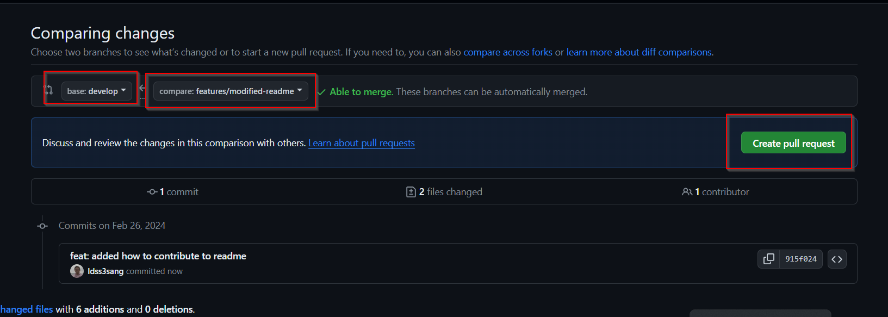
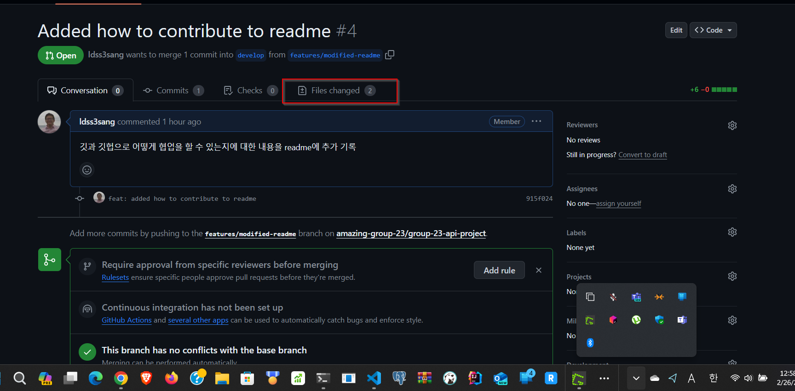

# Project Summary

Building Movie OST Search Application using APIs, JavaScript, HTML, CSS 🚀🚀🚀🚀🚀🚀🚀🚀

# Members

- [Doeveloper(도상석)](https://github.com/ldss3sang) - Scrum Master
- [Dawon Yoon(윤다원)](https://github.com/Dawon-yoon) - Product Owner
- [gmlwls1710(안희진)](https://github.com/gmlwls1710)
- [simee(심재은)](https://github.com/simi-22)
- [MEWji(심윤지)](https://github.com/simyoonji)

# APIs

- [The Movie Database](https://developer.themoviedb.org/docs/getting-started)
- [Spotify](https://rapidapi.com/Glavier/api/spotify23)

# Features

- Movie list
  - Display a list of movie
  - Pagination
- Movie search
  - Search a movie by title
  - Display a search result
- Movie detail
  - Display the detail of a selected movie
  - Title, Synopsis, Trailers, Rate, etc
- Movie OST list and play
  - Get movie OST songs using spotify API
  - List songs of the movie OST
  - Play a song
- Dark Mode
  - Turn on/off dark mode
  - Apply it to the whole application

# Project Structure

```
(root)
   |-- index.html      // 홈 화면 
   |-- main.js
   |-- style.css
   |-- README.md
   |-- detail (folder) // 상세 화면과 영화 OST 기능
   |   |-- index.html
   |   |-- main.js
   |   |-- style.css
   |-- search          // 검색 기능
   |   |-- index.html
   |   |-- main.js
   |   |-- style.css
   |-- assets
   |   |-- img        // image 파일 모아둔 곳
```

# Branches

- `main` branch: 프로덕션에 배포될 브랜치. 절대 터치 ❌🙅‍♂️🙅‍♀️
- `develop` branch: 개발을 진행할 브랜치. `main` 브랜치에서 파생됨.
- `featuers` branch: 기능 구현을 진행하는 브랜치. `develop` 브랜치에서 파생됨.

# How To Contribute

1. 프로젝트를 로컬로 클론 - `git clone https://github.com/amazing-group-23/group-23-api-project.git` (처음에 한번만)
1. `develop` 브랜치를 최신 코드로 업데이트 - `git pull origin develop`
   - pull이 되지 않거나 에러가 날때는 보통 commit을 하지 않은 변경 사향들이 원인 되므로 커밋을 하거나 변경사항들을 없앰.
1. 작업 할 features 브랜치를 생성 - `git checkout -b features/xxxxxxx`
1. 생성된 features 브랜치에서 작업함
1. 작업이 끝난 후 해당 featuers 브랜치에 commit - `git add . ` 하고 `git commit -m "xxxxxxxx"`
1. `develop` 브랜치로 다시 돌아가서 최신 코드로 업데이트 - `git checkout develop` 하고 `git pull origin develop`
1. 본인 작업하던 features 브랜치로 다시 돌아오기 - `git checkout features/xxxxxxxx`
1. `develop` 브랜치를 본인 features 브랜치에 merge하기 - `git merge develop`
   - 충돌이 일어날시 해결하고 commit하기
   - 머지 후에 commit 해야 될 것 있다면 커밋하기 (이유는 자동 커밋이 안 될 경우도 있음)
1. features 브랜치 리모트 저장소인 Github에 push하기 - `git push origin features/xxxxxxx`
1. 깃헙 리모트 저장소로 가서 `develop` 브랜치로 Pull Request 보내기
   - https://github.com/amazing-group-23/group-23-api-project 에서 Pull Request 선택 후 New pull request  
     
   - `develop` <= `features/xxxxxxxx` 로 pull request 생성
     
   - Pull Request 제목과 설명 추가적으로 더 작성하고 pull request 생성
     
   - Pull Request 리뷰 후 머지 (`Files changed`에서 변경된 사항 볼 수 있음)
     
